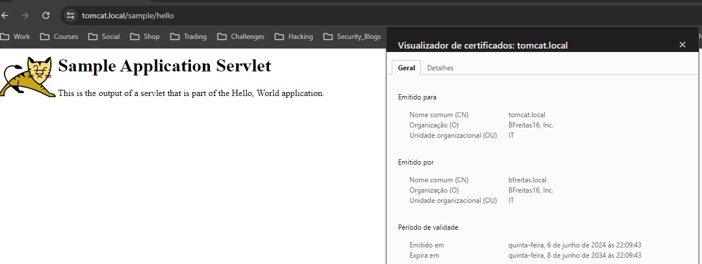
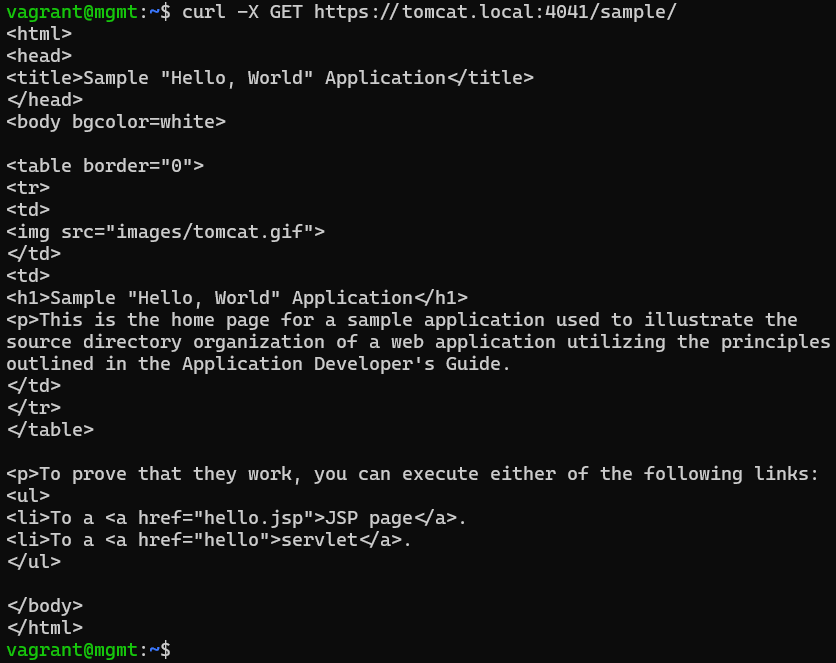

# Tomcat 8.5 Sample Web Application

More information about this application can be found [here](https://tomcat.apache.org/tomcat-8.5-doc/appdev/sample/).

------------------------------

## Table of Contents
- [Requirements](#requirements)
- [Project Structure](#project-structure)
- [How to Run](#how-to-run)
  - [Run Using Vagrant](#run-using-vagrant)
  - [Run Using Docker Compose](#run-using-docker-compose)
  - [Run Using Docker](#run-using-docker)
- [How to Test](#how-to-test)
  - [Runs with Vagrant](#runs-with-vagrant)
  - [Runs with Docker Compose and Docker](#runs-with-docker-compose-and-docker)

------------------------------

## Requirements
* The docker base image is centos:7
* Tomcat version is 8.5
* The docker must expose the port 4041
* SSL/TLS is enabled at the 4041 endpoint.
* No manual commands should be required after the docker run command is executed in order to start and make the Sample App available.

## Project Structure
The folder structure of this project is as follows:
```
|- Vagrantfile
|- docs
|- scripts
|   |- bootstrap-mgmt.sh
|   |- create-ca-certificate.sh
|   \- create-signed-certificate.sh
\- infrastructure
    \- tomcat
        |- Dockerfile
        |- docker-compose.yml
        |- tomcat-clean.sh
        |- tomcat-run.sh
        |- conf
        |   \- server.xml
        \- certificates
            |- rootCACert.pem
            |- rootCAKey.pem
            |- tomcat.local.crt
            \- tomcat.local.pem
```

* The `Vagrantfile` is the file to build the local environment.
* The `docs` folder contains the support documents (for instance, images of the tests done).
* The `scripts` folder contains the scripts ran by Vagrant.
  * The `bootstrap-mgmt.sh` script bootstraps the VM with all the necessary tools.
  * The `create-ca-certificate.sh` script creates the CA Key and Certificate.
  * The `create-signed-certificate.sh` script creates a private Key and a signed Certificate (by the CA). 
* The `infrastructure` folder contains the services' IaaC.
  * The `tomcat` folder contains the **Tomcat** IaaC.
    * The `Dockerfile` contains the code to build the Tomcat's Docker image.
    * The `docker-compose` contains the code to deploy the Tomcat container.
    * The `tomcat-clean.sh` script automatically cleans everything related to the Tomcat service.
    * The `tomcat-run.sh` script automcatically build and run the Tomcat service.
    * The `conf` folder contains the Tomcat configuration.
      * The `server.xml` specifies the Tomcat configuration.
    * The `certificates` contains the certificates important to the Tomcat service.
      * The `rootCACert.pem` is the CA certificate.
      * The `rootCAKey.pem` is the CA private Key.
      * The `tomcat.local.crt` is the Tomcat certificate signed by CA.
      * The `tomcat.local.pem` is the Tomcat private Key.

## How to Run
You can run this project using three approaches
- [Run Using Vagrant](#run-using-vagrant)
- [Run Using Docker Compose](#run-using-docker-compose)
- [Run Using Docker](#run-using-docker)

### Run Using Vagrant 

#### Prerequisites
To run this application, the following software is required:
* Vagrant (version 2.4.1)
* Virtualbox (version 6.1)

#### Steps
For all the next steps, you should be in the project's root folder.
1. Create a provisioned _Ubuntu_ VM that deploys the Tomcat container by running the following command
```
vagrant up
```

2. Install the generated self-signed CA certificate in your OS (file called `rootCACert.pem`)

3. Access _https://127.0.0.1/sample_ on the browser. Note that you do not need to specify the https port because the VM created by Vagrant has configuring a port forwarding from 443 to 4041.

#### Stop
1. Run the following command to delete the VM:
```
vagrant destroy -f
```

### Run Using Docker Compose

#### Prerequisites
To run this application, the following software is required:
* Docker (version 26.1.4)
* Docker Compose (version v2.27.1)

#### Steps
1. Deploy the Tomcat container by running the following command
```
sh tomcat-run.sh
```

2. Install the generated self-signed CA certificate in your OS (file called `rootCACert.pem`)

3. Access _https://127.0.0.1:4041/sample_.

##### What is Executed
The `tomcat-run.sh` script executed the following commands inside the `infrastructure\tomcat` folder.
1. Build the docker image by running the following command
```
docker build . -t bfreitas/tomcat:1.0
```

2. Start the Tomcat service in the background using the following command
```
docker-compose up -d
```

#### Stop
1. Run the following script to delete everything:
```
sh tomcat-clean.sh
```

### Run Using Docker

#### Prerequisites
To run this application, the following software is required:
* Docker (version 26.1.4)

#### Steps
For all the next steps, you should be in the `infrastructure\tomcat` folder.
1. Build the docker image by running the following command
```
docker build . -t bfreitas/tomcat:1.0
```

2. Run the Tomcat container using the following command
```
docker run -d --name tomcat -p 8080:8080 -p 4041:4041 \
  --mount type=bind,source=./conf/server.xml,target=/opt/tomcat/apache-tomcat-8.5.100/conf/server.xml \
  --mount type=bind,source=./certificates,target=/opt/tomcat/apache-tomcat-8.5.100/conf/certificates \
  -e "CATALINA_BASE=/opt/tomcat/apache-tomcat-8.5.100" \
  -e "CATALINA_HOME=/opt/tomcat/apache-tomcat-8.5.100" \
  bfreitas/tomcat:1.0
```

3. Install the generated self-signed CA certificate in your OS (file called `rootCACert.pem`)

4. Access _https://127.0.0.1:4041/sample_.

#### Stop
1. Run the following commands to stop and delete everything:
```
docker stop tomcat && docker rm tomcat && docker system prune -a -f
```

## How to Test

Note: All the following sections specify that to access the service we should use _127.0.0.1_. You can specify the following entry on local DNS (`Windows`: _C:\Windows\System32\drivers\etc\hosts_; `Linux`: _/etc/hosts_) to access it on browser via `tomcat.local`:
```
127.0.0.1 tomcat.local
```

### Runs with Vagrant
If you used Vagrant to deploy the application, all you have to do is to access the browser on https://127.0.0.1/sample/.



Another test can be using the cURL command (for example, inside the Vagrant VM) to do an HTTP GET request to https://127.0.0.1/sample/.



### Runs with Docker Compose and Docker
All you have to do is to access it on https://127.0.0.1:4041/sample/. For example, you can use the cURL command to do an HTTP GET request to that same URL.
